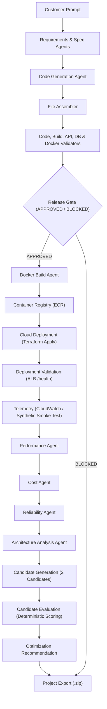

# AI Product Architect — Delivery, Deployment, Monitoring & Optimization MVP

An end-to-end autonomous agent system that transforms a single customer natural-language product prompt into full-stack production source files, validates code integrity, builds Docker containers, deploys to AWS ECS Fargate, monitors runtime telemetry, performs deterministic architecture optimization, and exports a clean downloadable ZIP project.

---

## 1. Pipeline Architecture



---

## 2. Fixed AWS Architecture Decisions

- **Single Container Multi-Stage Build**: `frontend/` React Single-Page Application is compiled with Node, and static assets are copied to `backend/static/` served directly by FastAPI.
- **Compute**: AWS ECS Fargate (running inside public subnets with `assign_public_ip = true`, no expensive NAT Gateways).
- **Networking & Routing**: Application Load Balancer (ALB) on HTTP port 80 forwarding to container port 8000.
- **Database**: Amazon RDS PostgreSQL in private database subnets; security group permits traffic exclusively from the ECS task security group.
- **Secrets Management**: `DATABASE_URL` and `JWT_SECRET` are secured in AWS Secrets Manager and passed directly to ECS task definitions via `secrets` blocks (never exposed in plain text environment variables or Terraform outputs).
- **Tagging**: All cloud resources tagged with `Project=<project_name>` and `ManagedBy=ai-product-architect`.
- **Demo Settings**: `deletion_protection = false`, `skip_final_snapshot = true`.

---

## 3. Deployment Modes

### Dry-Run Mode (Default)
```bash
python scripts/generate_project.py --deploy-mode dry-run
```
- Performs container build validation, executes `terraform init` and `terraform plan`.
- **No cloud resources are created.**
- Deployment statuses report `SKIPPED (dry-run)`.
- `service_url` remains `NOT AVAILABLE`.
- Optimization candidates and cost breakdown are calculated statically.
- Generates clean project ZIP in `generated_projects/<project_id>.zip`.

### Real AWS Deployment Mode
```bash
python scripts/generate_project.py --deploy-mode real --approve
```
- Requires AWS credentials in `.env` or system environment (`AWS_ACCESS_KEY_ID`, `AWS_SECRET_ACCESS_KEY`, `AWS_REGION`).
- Deploys ECR repository, pushes container image, provisions ALB, ECS Fargate, RDS PostgreSQL, and Secrets Manager.
- Polling verification waits for ECS tasks to stabilize, queries ALB `/health` endpoint, and tests database connectivity.
- Executes 50 synthetic smoke test requests to measure live p50/p95 latency and HTTP error rates.
- `service_url` is exposed **only if deployment validation passes**.

---

## 4. Teardown / Destroy Command

To completely tear down and destroy cloud resources provisioned by a real deployment:
```bash
python scripts/generate_project.py --destroy --project-path generated_projects/<project_id>
```
This safely runs `terraform destroy -auto-approve` inside the project's infrastructure folder.

---

## 5. Status Vocabulary Standard

The system strictly adheres to the unified status vocabulary:

- **Stage Status**: `PASSED` | `FAILED` | `SKIPPED` | `UNAVAILABLE`
- **Health Status**: `HEALTHY` | `DEGRADED` | `UNHEALTHY` | `INSUFFICIENT_DATA`

---

## 6. Optimization Loop Scoring Formula

Candidates are evaluated deterministically against the current baseline architecture using:

$$\text{Score} = 0.35 \times \text{Perf} + 0.30 \times \text{Rel} + 0.25 \times \text{Cost} + 0.10 \times \text{Complexity}$$

- **Hard Gate**: `requirement_compliance == 100%`. Candidates below 100% are immediately **DISQUALIFIED**.
- **Overrides**: Emitted as variable files (`optimization/candidate_a.tfvars`, `optimization/candidate_b.tfvars`) overriding the base Terraform module without modifying template code.
- **Safety**: No automatic redeployment is triggered. Recommendations provide exact `.tfvars` file paths for human review.

---

## 7. Running Tests

Run the complete test suite (all tests mock external subprocesses and cloud providers):
```bash
python -m pytest
```

### Safety and Clean Export
Exported ZIP archives strictly exclude sensitive environment files and state:
- `.env`
- `*.tfstate*`
- `.terraform/`
- `__pycache__/`
